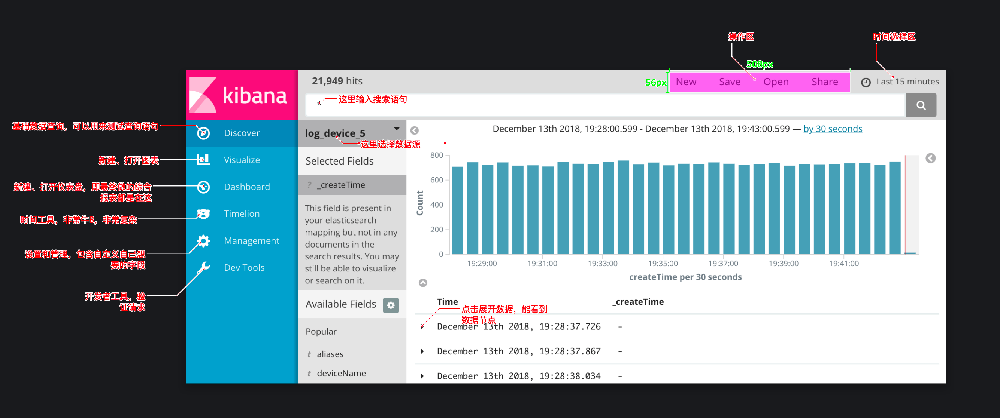
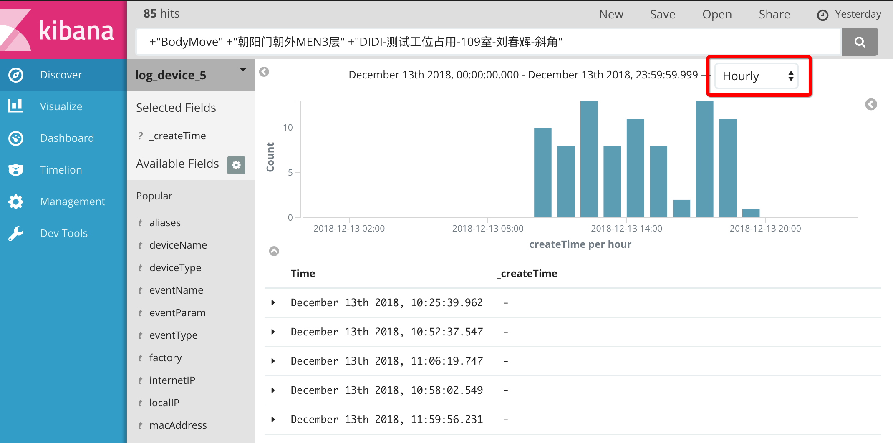
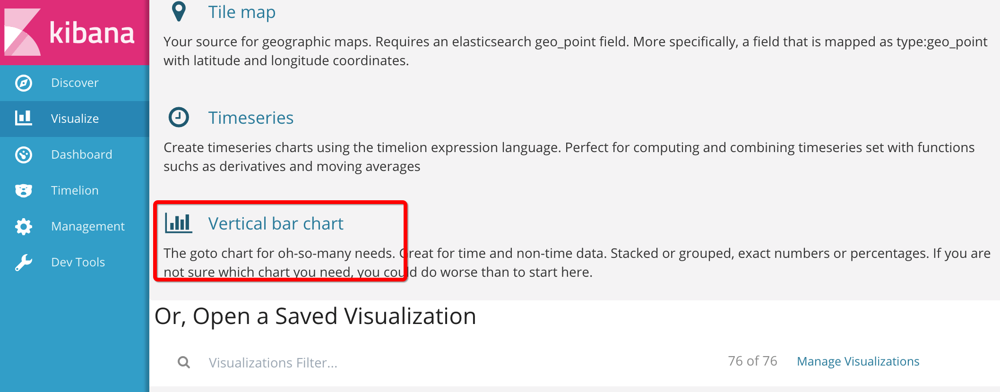
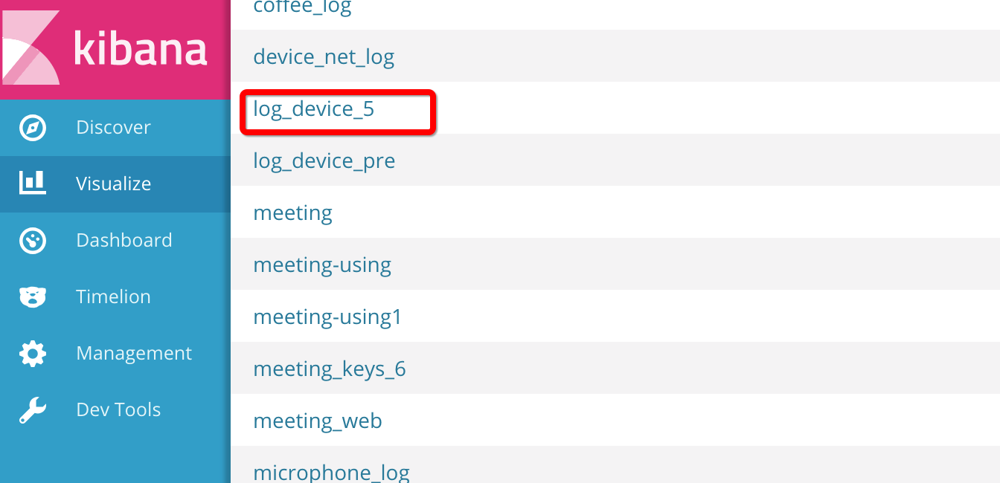
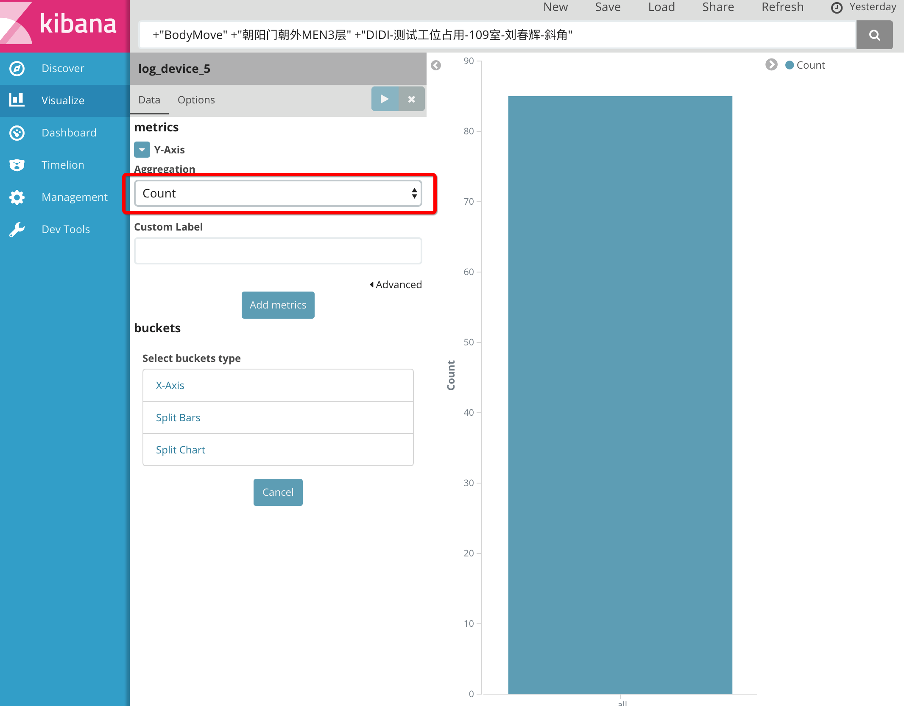
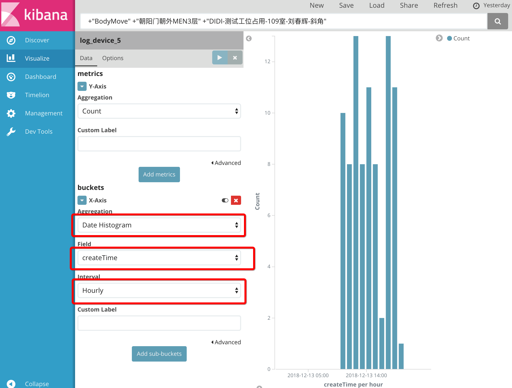
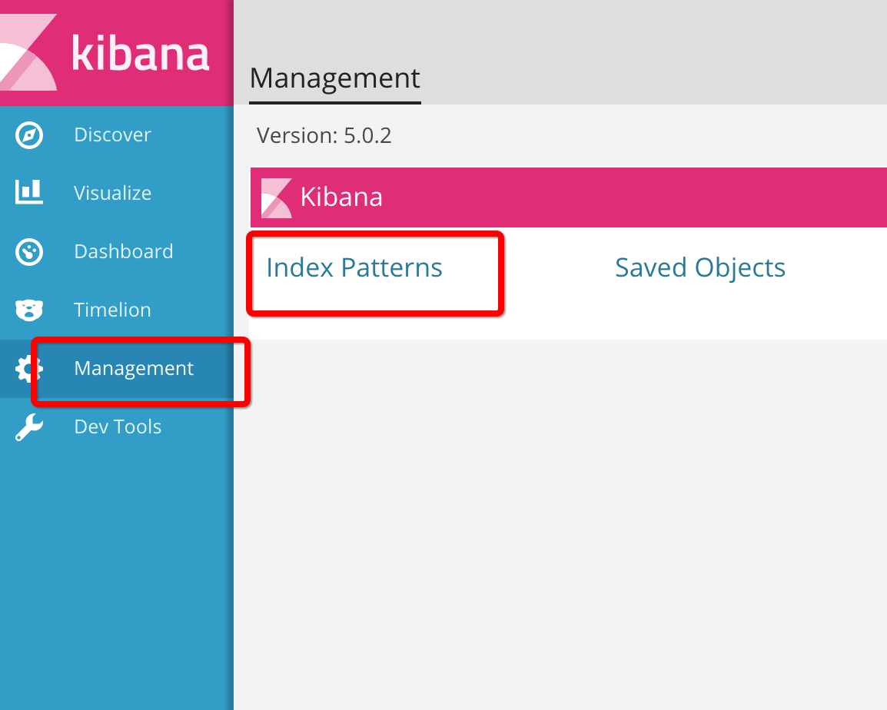
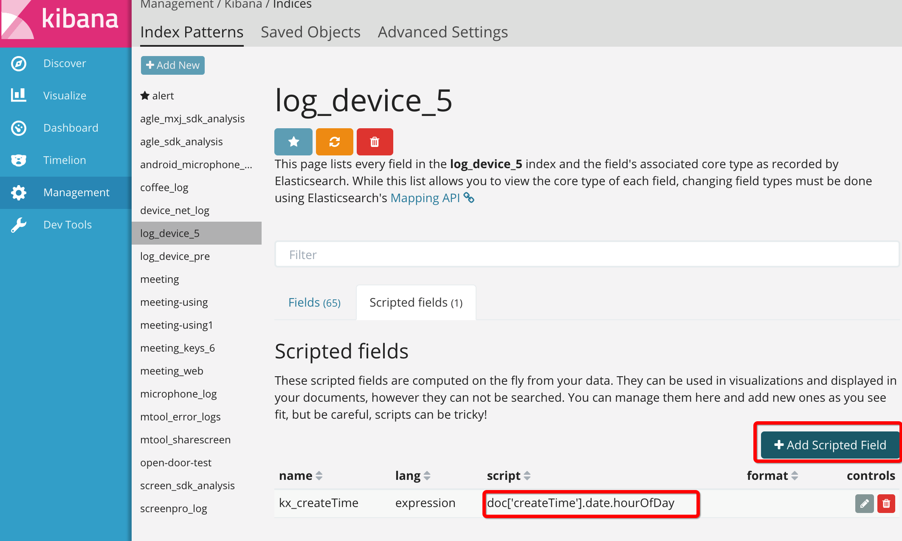
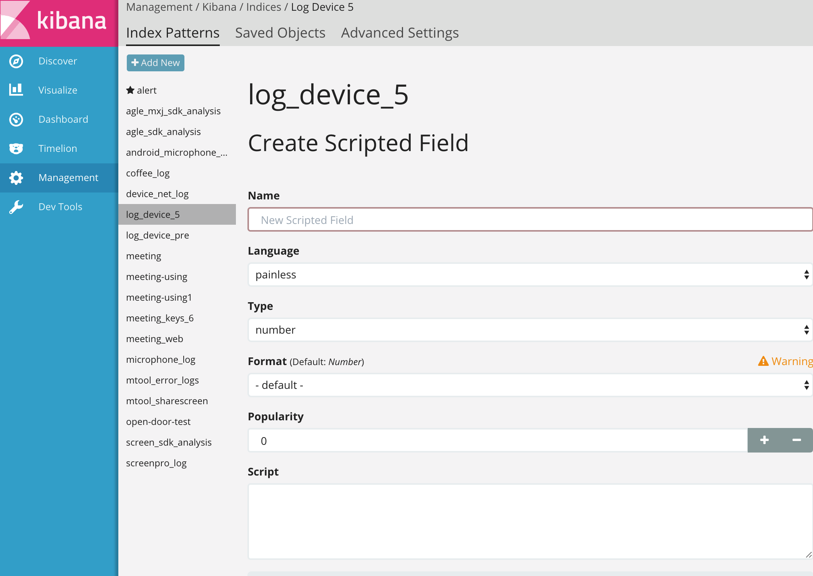

# Kibana 配置「人体感应器」工时记录

> 需求：
> 1. 展示指定范围内的「人体感应器」的数据，例如成都、北京等某场地的某一个或者多个设备数据。
> 2. 以指定时间段为间隔呈现数据，例如：每分钟，每10分钟，每小时，每天等。
> 3. 可以指定任意时间段查看设备数据，例如：最近7天，上周，上月，从某时间到某时间等。

## 一. 打开elk，并测试查询  

### 1. 打开elk 
如图：




```
ELK搜索条件，常用语法：

1. 要搜索一个确切的字符串，即精确搜索，需要使用双引号引起来：path:”/app/logs/nginx/access.log”
2. 如果不带引号，将会匹配每个单词：uid token
3. 模糊搜索：path:”/app/~”
4. \* 匹配0到多个字符：*oken
5. ? 匹配单个字符 : tok?n
6. +：搜索结果中必须包含此项 -：不能含有此项 什么都没有则可有可无： +token -appVersion appCode
7. 运算符AND/OR/NOT必须大写：token AND uid ；token OR uid；NOT uid
8. 允许一个字段值在某个区间（[] 包含该值，{}不包含）：@version:[1 TO 3]
9. 组合查询：(uid OR token) AND version
10. 转义特殊字符 + – && || ! ( ) { } [ ] ^ ” ~ * ? : \ 转义特殊字符只需在字符前加上符号\
```

### 2. 输入查询语句

```
+"BodyMove" +"朝阳门朝外MEN3层" +"DIDI-测试工位占用-109室-刘春辉-斜角"
```
并设置查询时间是 `Yesterday`，这样我们得到如下图：



红框处，可以切换统计时间片段，默认是`30mins`，这里切换到`hourly`。

## 二. 制作图表

### 1. 选择图表

进入`Visualize`界面，根据`需求`，选择`Vertical bar chart`，如图：


### 2. 选择数据源

选择 `log_device_5`，如图：



### 3. 插入查询
```
+"BodyMove" +"朝阳门朝外MEN3层" +"DIDI-测试工位占用-109室-刘春辉-斜角"
```
### 4. 设置`Y-Axis`

如图：



### 5. 设置`buckets -> X-Axis`
1. 选择`Aggregation`为`Date Histogram`
2. 选择`Field`为`createTime`
3. 选择`Interval`为`Hourly`
点击`run`后，如图：



### 5. `Save`图表

## 三. 统计工时
### 1. 设置

如图：



### 2.  Add Script Field

如图：



### 3. 设置Script Field属性

如图：



`Script`字段填入：
```
doc['createTime'].date.hourOfDay
```