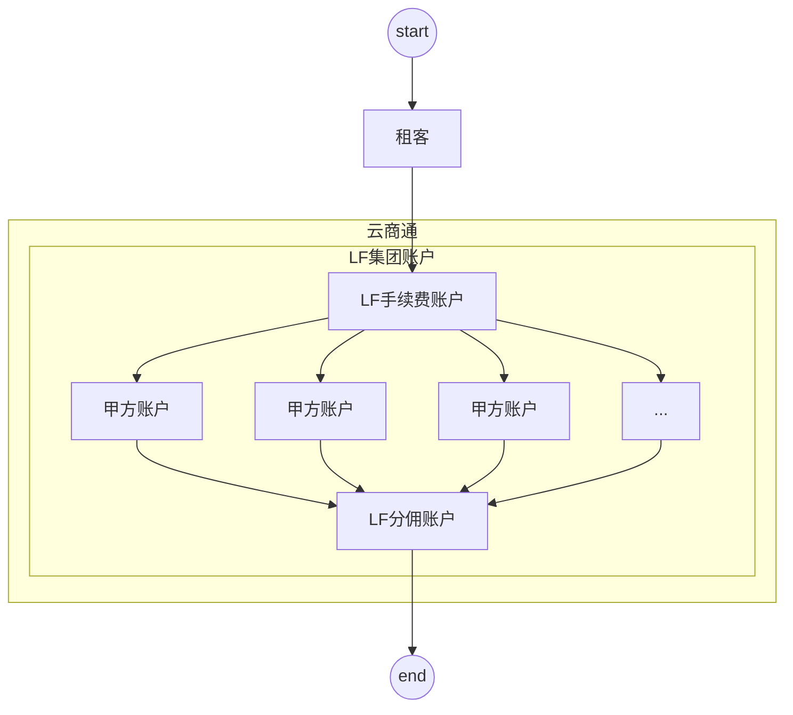
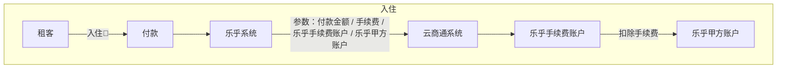
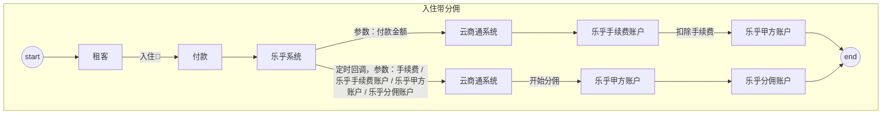

# 通联支付流程

## 支付模型

```mermaid
graph TD;
a[甲方账户];
b[甲方账户];
c[甲方账户];
cc[...];
dd[LF手续费账户];
e["LF分佣账户"];
zk[租客];

a1((start))-->zk
zk-->dd
subgraph 云商通
subgraph LF集团账户


dd-->a;
dd-->b;
dd-->c;
dd-->cc;

a-->e
b-->e
c-->e
cc-->e
end
end
e-->b1((end))
```

## 入住流程

```mermaid
graph TD;
zk[租客];
pay[付款];
lf[乐乎系统];
yst[云商通系统];
sxf_a[乐乎手续费账户];
jf_a[乐乎甲方账户];

subgraph 入住
zk--"入住"-->pay;
pay-->lf;
lf--"参数：付款金额 / 手续费 / 乐乎手续费账户 / 乐乎甲方账户"-->yst;
yst-->sxf_a
sxf_a--"扣除手续费"-->jf_a
end

```

## 入住分佣流程

```mermaid
graph TD;
zk[租客];
pay[付款];
lf[乐乎系统];
yst[云商通系统];
yst2[云商通系统];
sxf_a[乐乎手续费账户];
jf_a[乐乎甲方账户];
jf_a2[乐乎甲方账户];
lf_a[乐乎分佣账户];

subgraph 入住带分佣
a((start))-->zk
zk--"入住"-->pay;
pay-->lf;
lf--"参数：付款金额 "-->yst;
lf--"定时回调，参数：手续费 / 乐乎手续费账户 / 乐乎甲方账户 / 乐乎分佣账户"-->yst2;
yst-->sxf_a
yst2--"开始分佣"-->jf_a2
sxf_a--"扣除手续费"-->jf_a
jf_a-->b((end))
jf_a2-->lf_a
lf_a-->b((end))
end

```
