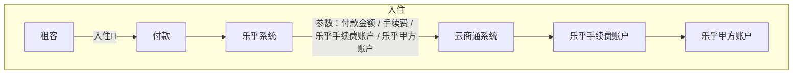
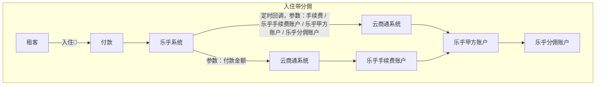

```mermaid
graph TD;
zk[租客];
pay[付款];
lf[乐乎系统];
yst[云商通系统];
sxf_a[乐乎手续费账户];
jf_a[乐乎甲方账户];

subgraph 入住
zk--"入住"-->pay;
pay-->lf;
lf--"参数：付款金额 / 手续费 / 乐乎手续费账户 / 乐乎甲方账户"-->yst;
yst-->sxf_a
sxf_a-->jf_a
end

```

```mermaid
graph TD;
zk[租客];
pay[付款];
lf[乐乎系统];
yst[云商通系统];
yst2[云商通系统];
sxf_a[乐乎手续费账户];
jf_a[乐乎甲方账户];
lf_a[乐乎分佣账户];

subgraph 入住带分佣
zk--"入住"-->pay;
pay-->lf;
lf--"参数：付款金额 "-->yst;
lf--"定时回调，参数：手续费 / 乐乎手续费账户 / 乐乎甲方账户 / 乐乎分佣账户"-->yst2;
yst-->sxf_a
yst2-->jf_a
sxf_a-->jf_a
jf_a-->lf_a
end

```